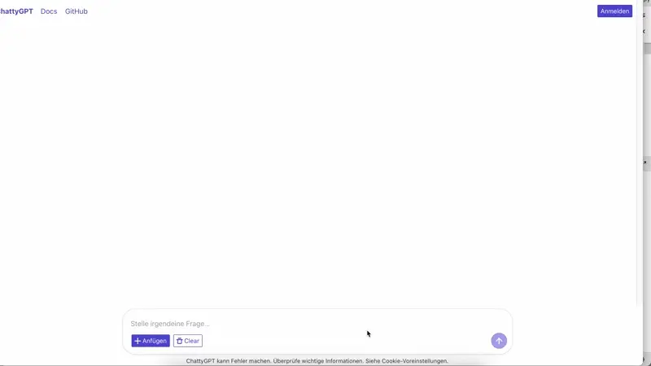

# ChattyGPT

ChattyGPT is a clone of ChatGPT that run *fully locally* with OpenSource models like Ollama.

## Features

* MultiChat with Ollama
* Upload of text files as context
* Client in React
* Server in Flask

